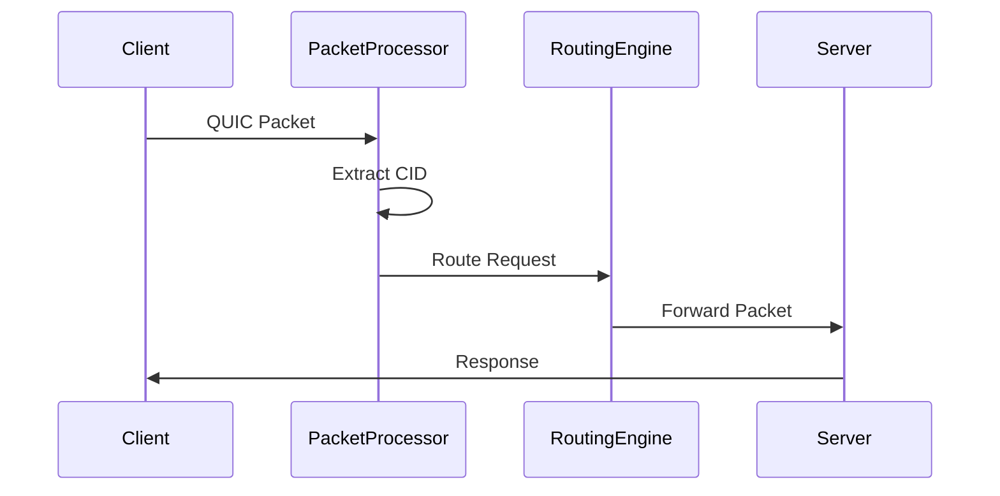
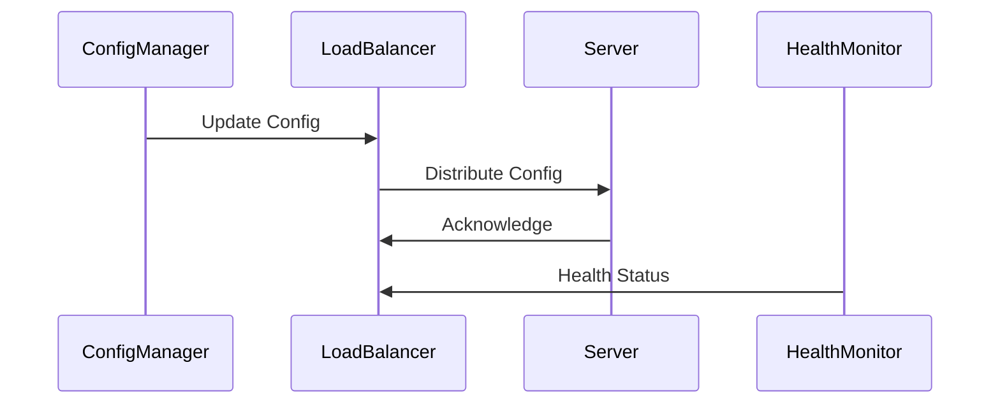

# QUIC Load Balancer Detailed Technical Design

## 1. Technology Stack Recommendations

### 1.1 Core Technologies
- **Programming Language**: Go
  - Excellent network programming support
  - Strong concurrency model with goroutines
  - High performance for packet processing
  - Good ecosystem for infrastructure software

- **Configuration Management**: 
  - YAML for static configuration
  - gRPC for dynamic configuration distribution
  - Protocol Buffers for data serialization

- **Monitoring & Metrics**:
  - Prometheus for metrics collection
  - OpenTelemetry for tracing
  - Grafana for visualization

### 1.2 Key Libraries
```go
// Recommended libraries
dependencies:
  - "github.com/lucas-clemente/quic-go"  // QUIC protocol implementation
  - "google.golang.org/grpc"             // gRPC for config distribution
  - "go.opentelemetry.io/otel"          // Telemetry
  - "github.com/prometheus/client_golang" // Metrics
  - "go.uber.org/zap"                    // Logging
```

## 2. Component Architecture

### 2.1 Packet Processor
**Draft Reference**: Section 12 (Packets and Frames)

```go
type PacketProcessor struct {
    // Handles parsing of QUIC packets
    headerParser   *HeaderParser
    // Packet validation
    validator      *PacketValidator
    // Connection tracking
    connTracker    *ConnectionTracker
    // Metrics
    metrics        *Metrics
}

type HeaderParser interface {
    // Extracts connection ID and other relevant fields
    ParsePacket(data []byte) (*QuicHeader, error)
    // Determines packet type
    ClassifyPacket(header *QuicHeader) PacketType
}
```

Key Features:
- Parse QUIC packet headers
- Extract Connection IDs
- Validate packet format
- Track connection state
- Implement Section 17 (Packet Formats) parsing

### 2.2 Connection ID Manager
**Draft Reference**: Section 5.1 (Connection ID) and Section 4 (Server ID Encoding)

```go
type ConnectionIDManager struct {
    // Connection ID configuration
    config         *CIDConfig
    // Encryption key management
    keyManager     *KeyManager
    // Server mappings
    serverMapper   *ServerMapper
}

type CIDConfig struct {
    // As defined in draft Section 4.1
    ServerIdLength uint8
    NonceLength   uint8
    ConfigRotation uint8
}

type KeyManager struct {
    // Key management for CID encryption
    currentKey    []byte
    previousKey   []byte
    nextKey       []byte
    rotationTime  time.Time
}
```

Features:
- Implement Section 4.3 (Server Actions)
- Handle CID encryption/decryption
- Manage key rotation
- Track server mappings

### 2.3 Routing Engine
**Draft Reference**: Section 3 (Load Balancing Preliminaries)

```go
type RoutingEngine struct {
    // Server pool management
    serverPool      *ServerPool
    // Connection tracking
    connTracker     *ConnectionTracker
    // Routing algorithms
    routingStrategy RoutingStrategy
}

type ServerPool struct {
    servers        map[ServerID]*Server
    healthMonitor  *HealthMonitor
}

type RoutingStrategy interface {
    // Core routing logic
    RoutePacket(packet *QuicPacket) *Server
    // Handle connection migration
    HandleMigration(oldConnID, newConnID []byte) error
}
```

Features:
- Implement routing algorithms
- Handle connection migration
- Manage server pool
- Track connection routing

### 2.4 Configuration Manager
**Draft Reference**: Section 18 (Transport Parameter Encoding)

```go
type ConfigManager struct {
    // Current configuration
    currentConfig  *LoadBalancerConfig
    // Config distribution
    distributor    *ConfigDistributor
    // Version management
    versionManager *VersionManager
}

type LoadBalancerConfig struct {
    // As defined in draft Section 18.2
    ConfigRotation    uint8
    ServerIDLength    uint8
    NonceLength       uint8
    EncryptionKey     []byte
    ServerMappings    map[ServerID]ServerInfo
}
```

Features:
- Manage LB configuration
- Handle config distribution
- Implement version negotiation
- Track config versions

### 2.5 Health Monitor
**Draft Reference**: Section 3.2 (Fallback Algorithms)

```go
type HealthMonitor struct {
    // Health check configuration
    config         *HealthCheckConfig
    // Server status tracking
    statusTracker  *ServerStatusTracker
    // Health check workers
    workers        []*HealthCheckWorker
}

type ServerStatus struct {
    ServerID       ServerID
    Health         HealthState
    LastCheck      time.Time
    Metrics        ServerMetrics
}
```

Features:
- Implement health checking
- Track server status
- Handle server failures
- Manage fallback routing

## 3. Data Flow

### 3.1 Packet Processing Flow


### 3.2 Configuration Flow


## 4. Detailed Implementation Plan

### Phase 1: Core Infrastructure (2-3 weeks)

#### Week 1: Basic Setup
1. Setup project structure
2. Implement packet parsing
   - Reference: Section 17 (Packet Formats)
   - Focus: Initial, Handshake, and 1-RTT packets
3. Basic configuration management

#### Week 2-3: Basic Routing
1. Connection ID extraction
   - Reference: Section 5.1 (Connection ID)
2. Server mapping
3. Basic packet forwarding

### Phase 2: Enhanced Routing (3-4 weeks)

#### Week 4-5: CID Management
1. Implement CID encryption
   - Reference: Section 4.3 (Server Actions)
2. Key management
3. Server ID encoding

#### Week 6: Health Monitoring
1. Health check implementation
2. Server pool management
3. Basic failover

### Phase 3: Production Features (4-5 weeks)

#### Week 7-8: Advanced Features
1. Config rotation
   - Reference: Section 2.1 (Config Rotation)
2. Connection migration
3. Advanced routing

#### Week 9-11: Optimization & Testing
1. Performance optimization
2. Load testing
3. Documentation
4. Monitoring & metrics

## 5. Interfaces

### 5.1 Configuration Interface
```protobuf
// Proto definition for configuration
service LoadBalancerConfig {
    rpc UpdateConfig(ConfigRequest) returns (ConfigResponse);
    rpc GetConfig(ConfigQuery) returns (ConfigDetail);
    rpc RotateKeys(KeyRotationRequest) returns (KeyRotationResponse);
}
```

### 5.2 Monitoring Interface
```go
type Metrics interface {
    // Connection metrics
    RecordConnection(connID []byte)
    // Routing metrics
    RecordRouting(server ServerID)
    // Health metrics
    RecordHealth(status ServerStatus)
}
```

## 6. Configuration Format

```yaml
loadbalancer:
  server_id_length: 8
  nonce_length: 16
  encryption_key: "base64_encoded_key"
  config_rotation:
    enabled: true
    interval: "24h"
  
servers:
  - id: "server1"
    address: "10.0.0.1:443"
    weight: 100
  - id: "server2"
    address: "10.0.0.2:443"
    weight: 100

monitoring:
  prometheus_port: 9090
  health_check:
    interval: "10s"
    timeout: "2s"
    failures_threshold: 3
```

## 7. Development Guidelines

### 7.1 Code Organization
```
quic-lb/
├── cmd/
│   └── quic-lb/
├── pkg/
│   ├── packet/      # Packet processing
│   ├── routing/     # Routing logic
│   ├── config/      # Configuration
│   ├── crypto/      # CID encryption
│   ├── health/      # Health monitoring
│   └── metrics/     # Monitoring
├── internal/
│   └── server/      # Server management
├── api/
│   └── proto/       # API definitions
└── test/
    └── integration/ # Integration tests
```

### 7.2 Testing Strategy
1. Unit tests for each component
2. Integration tests for end-to-end flows
3. Performance benchmarks
4. Chaos testing for failure scenarios

### 7.3 Monitoring Recommendations
1. Key Metrics:
   - Packets processed/sec
   - Routing latency
   - Server health status
   - Config rotation status
   - Error rates

2. Logging:
   - Structured logging
   - Correlation IDs
   - Error tracking
   - Performance monitoring

## 8. Security Considerations

### 8.1 Key Management
- Regular key rotation
- Secure key storage
- Audit logging
- Access control

### 8.2 Config Distribution
- TLS for config API
- Authentication
- Authorization
- Config validation

This detailed design provides a comprehensive blueprint for implementing a QUIC load balancer with clear references to the draft specification. Would you like me to elaborate on any specific aspect?